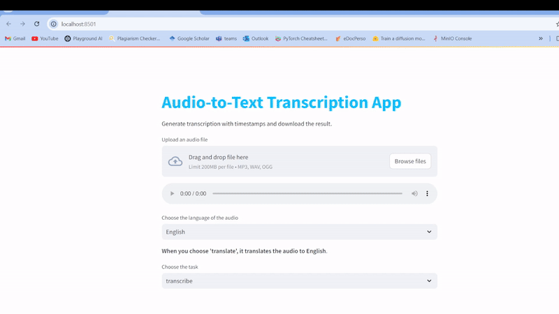

# Audio Transcription App (Whisper and Streamlit)

### Demo
------------------------


### CLICK TO WATCH THE VIDEO
[](https://youtu.be/56upVPEJbm0)

This repository contains the Python code for an audio transcription web application built using the Hugging Face Whisper model and Streamlit.

- This script utilizes the openai/whisper-small model to transcribe or translate audio files.
- Users can upload audio files and choose the source language (English, Hindi, French) and the task (transcription or translation).
- The app provides transcriptions with timestamps and the option to download the output as a text file.


------

## Installation:

Transcribing mp3 file to numpy requires the FFmpeg. Follow the steps in this link to have it installed. [(How to install FFmpeg in windows)](https://www.wikihow.com/Install-FFmpeg-on-Windows)


You can install these libraries using pip:
```
pip install transformers streamlit
```
You may also need to download additional NLTK data for tokenization. You can do this using the following command:
```
import nltk
nltk.download('punkt_tab')
```

To run this app, write this on your command line:
```
streamlit run app.py
```
------

## Resources:

-[whisper on hugging face](https://huggingface.co/openai/whisper-small)

-[how to process long audio using whisper](https://huggingface.co/blog/asr-chunking)


